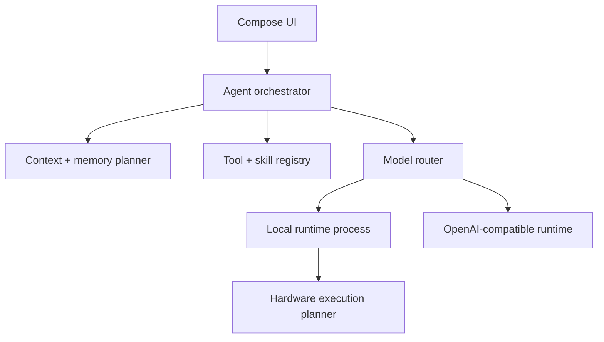

# Architecture

## Product principles

1. **Stable before fast.** Every execution plan is probation-tested and cached against the device, driver, engine, and model fingerprints. A failure produces a more conservative retry, not a dead chat.
2. **Local by policy, not by accident.** Each request has an explicit privacy class and routing mode. Remote fallback cannot silently receive private content.
3. **One agent, replaceable runtimes.** Agent behavior, tools, memory, skills, scheduling, and UI do not depend on llama.cpp or a remote API.
4. **Context is a budget.** A large model window is available to the planner, but relevance and predictable output headroom decide what enters a request.
5. **Generated capabilities start untrusted.** An agent-created skill is a draft until its permissions, tests, and content are reviewed or an explicit policy activates it.
6. **Identity is versioned data.** Bram's persona is supplied to an agent run and versioned independently of the model, runtime, tools, and UI.

## Module map

| Module | Responsibility |
|---|---|
| `app` | Compose UI, Bram's default identity, app state, dependency assembly |
| `core:domain` | Runtime-neutral models and interfaces |
| `core:agent` | Context planning, routing, execution planning, tool loop |
| `platform:android` | Device profiling and Keystore persistence |
| `runtime:openai` | OpenAI-compatible Chat Completions adapter |
| `runtime:llamacpp` | GGUF catalog, AIDL inference process, pinned llama.cpp/JNI runtime |
| `platform:android` | Device profiling, conversation storage, Keystore persistence |



## Model and runtime registry

A `ModelDescriptor` is the user-visible model identity. A `ModelRuntime` is one way to execute it. This allows the same logical model to have multiple runtime variants, such as Q4_0 Hexagon, Q4_K_M Adreno, CPU safe mode, or a remote endpoint.

Agent identity is separate from model identity. Each run receives an `AgentIdentity` containing a stable ID, version, display name, and system prompt. Bram is the bundled default, but alternate user or skill-specific identities can use the same orchestrator. Prompt-prefix and KV caches must include the agent identity ID and version in their fingerprints.

Runtime capabilities are probed, not inferred only from the phone model. A persisted validation key should eventually contain:

```text
device fingerprint + OS build + driver fingerprint + engine build
+ model hash + quantization + context/KV settings + backend split
+ agent identity ID/version
```

The planner may propose CPU, GPU, NPU, hybrid, and storage-assisted candidates. "Uses all hardware" means every viable backend is considered and benchmarked; it does not imply that CPU, GPU, and NPU should always run simultaneously.

## Context and memory

The transcript remains canonical and is never destructively summarized. Derived layers are replaceable:

| Layer | Purpose | Prompt behavior |
|---|---|---|
| Recent transcript | Exact local conversational state | Preserved verbatim first |
| Working summary | Older active-thread state | Included when older turns are omitted |
| Semantic facts | Stable preferences and facts | Retrieved by relevance and policy |
| Episodic memory | Prior events/outcomes | Retrieved for related tasks |
| Skill state | Procedures and assets | Loaded only when selected |
| Runtime cache | KV/prefix cache | Reused only when its fingerprint matches |

`ContextWindowManager` reserves output tokens before admitting input. It records which messages or memories were included and omitted so the UI can eventually explain context decisions. Exact tokenizer counts should come from the selected local runtime or endpoint when available; the scaffold uses a conservative heuristic fallback.

When a conversation exceeds the window, the intended sequence is:

1. Keep system policy and the newest coherent turn group.
2. Retrieve task-relevant memories.
3. Include the current working summary.
4. Compact omitted turns asynchronously into a new versioned summary.
5. Preserve references from summaries/memories back to source message IDs.

## Agent loop

The loop supports multiple model/tool turns with a hard turn budget. Tools expose JSON schemas and required permissions. Before execution, the permission gate can allow once, allow for the run, require confirmation, or deny. Tool output is treated as untrusted content and returned to the model with its tool-call ID.

Built-in tool families can later include files selected through Android's Storage Access Framework, device status, local HTTP, app intents, notifications, and constrained shell-like operations implemented as typed APIs. Arbitrary shell access should not be a default mobile capability.

## Skills

Skills are versioned packages rather than free-form prompt snippets:

```text
skills/<skill-id>/<version>/
  manifest.json
  instructions.md
  tests/
  assets/
```

The manifest declares model requirements, tool dependencies, requested permissions, entry instructions, version, author (`user`, `agent`, or `bundled`), and lifecycle state (`draft`, `active`, `disabled`, `quarantined`). Agent-created changes produce a new draft version. Activation is a separate policy decision, making rollback and auditing straightforward.

## Automation and "cron"

Android is not a Unix server and cannot promise unrestricted cron execution. The scheduler contract maps work according to intent:

- WorkManager for persistent, deferrable, constrained work.
- A chain of one-shot jobs for calendar-like cron expressions.
- AlarmManager only for user-visible tasks that truly require exact timing and have the required permission.
- A foreground service for a user-noticeable inference run that must continue while the app is not visible.

Every autonomous run needs a time/token/tool budget, network and charging constraints, a model-routing policy, and a user-visible result or failure record.

## Process and failure isolation

Native inference belongs in `:inference`, a separate Android process exposed through AIDL. The
service, its JNI bridge, and native library live together in `runtime:llamacpp`; this avoids a
module dependency cycle and prevents model browsing from loading native code in the UI process.
The UI process owns conversation state and checkpoints prompts before generation. If a driver or
native backend crashes, the UI marks the loaded plan unavailable while keeping the chat visible.

The AIDL control plane uses JSON payloads so the contract can evolve before the native protocol
stabilizes. Token deltas currently use one-way Binder callbacks. Once physical profiling identifies
Binder overhead, deltas can move to a pipe/shared-memory transport while control remains in AIDL.

A load is identified by model, context, offload plan, backend filter, and reasoning setting
together. Treating any of these as incidental is not safe: an early version keyed only on model and
context, so switching from CPU to GPU silently reused the CPU-resident model and reported the
accelerator as agreeing perfectly with itself.

Model bytes are copied into app-private storage at import and loaded from that path. Handing native
code a `/proc/self/fd` path for a document-provider descriptor does not work under scoped storage,
which refuses the re-open that llama.cpp performs internally.

## Accelerator validation

Compiling a backend says nothing about whether it computes correctly. Bram records a deterministic
greedy decode on CPU and requires an accelerator to reproduce it before reporting it as validated.

The comparison is teacher-forced: both backends receive the identical reference token sequence and
are asked only for the next-token prediction at each position. Free-running generation cannot be
scored, because one differing token sends the remainder somewhere unrelated and a small numerical
difference becomes indistinguishable from a broken kernel. Exact equality is also the wrong bar,
since a quantized accelerator legitimately disagrees on near-ties; the threshold is near-total
agreement.

This is not defensive over-engineering. A GPU backend on the target device reports success, raises
no driver error, and returns all-zero logits past a handful of offloaded layers. A speed comparison
called it working.

## Conversations and background work

Conversations are stored as one JSON file each with a rebuildable index, rather than a single blob:
a thread grows without bound, and rewriting every conversation to append a message would slow down
as Bram is used. Messages carry ordered activity entries for reasoning and tool calls, so the
transcript can collapse agent work to a line without discarding it.

Agent runs belong to an application-scoped coroutine scope and hold a foreground service for their
duration. The model already executes in `:inference`; what needs protecting is the work driving it,
which would otherwise be cancelled when the screen goes away. Stopping is a user action, not a
consequence of navigation.

## Running code on Android

Two consequences of one platform rule shape what Bram's agent can be, so they are recorded here
rather than rediscovered as failed attempts.

Android blocks `execve()` on files under an app's data directory for apps targeting API 29 and
above — a write-xor-execute policy enforced through SELinux. Bram targets well above that. The only
sanctioned way for an app to execute native code it ships is from the APK's native library
directory, which is where Bram's own `.so` files already live and is not a general-purpose place to
put downloaded binaries.

**Bram cannot host stdio MCP servers.** That transport works by spawning the server as a child
process. Streamable HTTP is the transport Bram can support, so its MCP story is remote servers plus
in-process native tools. Most published servers are stdio, so this is a real limitation and is
stated as one rather than left for a user to discover.

**Bram will not ship its own shell.** Doing so means a Termux-sized userland — shell, coreutils,
package management — with every binary repackaged as a library, on a path the platform keeps
tightening. Termux itself stays on an old `targetSdkVersion` to avoid the rule and is rebuilding its
packaging to escape that dependence.

Instead Bram delegates to Termux when the user has it, through Termux's `RUN_COMMAND` intent, and
the execution restriction remains Termux's problem to solve. This is the widest capability Bram
offers — running commands as the user — so it sits behind the tool permission model rather than
beside it. Termux being absent, not configured for external apps, or refusing the permission are
all ordinary outcomes, and Bram reports them as conditions rather than failures.

## Remote providers and routing

The first remote adapter targets the widely supported `POST /chat/completions` contract, including function tools. The domain API does not expose Chat Completions types, so a later Responses adapter or another provider does not leak into the agent.

Automatic routing scores only candidates that pass hard gates:

- Privacy and whether remote use is permitted.
- Required modalities, tool calling, context size, and structured output.
- Runtime availability and current memory/thermal state.
- User priorities such as local-only, fastest, battery-saving, or best-quality.

Later scoring can add measured latency, quality evaluations, battery cost, endpoint price, network status, and speculative local/remote races. Background outsourcing must remain visible in the run record and obey the conversation's privacy policy.
