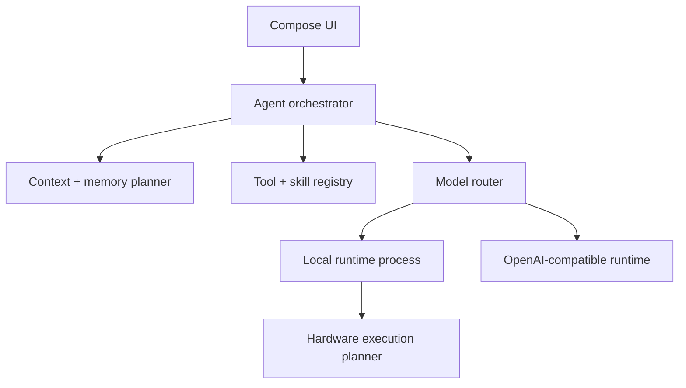

# Architecture

## Product principles

1. **Stable before fast.** Every execution plan is probation-tested and cached against the device, driver, engine, and model fingerprints. A failure produces a more conservative retry, not a dead chat.
2. **Local by policy, not by accident.** Each request has an explicit privacy class and routing mode. Remote fallback cannot silently receive private content.
3. **One agent, replaceable runtimes.** Agent behavior, tools, memory, skills, scheduling, and UI do not depend on llama.cpp or a remote API.
4. **Context is a budget.** A large model window is available to the planner, but relevance and predictable output headroom decide what enters a request.
5. **Generated capabilities start untrusted.** An agent-created skill is a draft until its permissions, tests, and content are reviewed or an explicit policy activates it.
6. **Identity is versioned data.** Bram's persona is supplied to an agent run and versioned independently of the model, runtime, tools, and UI.

## Module map

| Module | Responsibility |
|---|---|
| `app` | Compose UI, Bram's default identity, app state, dependency assembly |
| `core:domain` | Runtime-neutral models and interfaces |
| `core:agent` | Context planning, routing, execution planning, tool loop |
| `platform:android` | Device profiling, Keystore persistence, AIDL inference process |
| `runtime:openai` | OpenAI-compatible Chat Completions adapter |
| `runtime:llamacpp` | llama.cpp boundary and future JNI/vendor integration |



## Model and runtime registry

A `ModelDescriptor` is the user-visible model identity. A `ModelRuntime` is one way to execute it. This allows the same logical model to have multiple runtime variants, such as Q4_0 Hexagon, Q4_K_M Adreno, CPU safe mode, or a remote endpoint.

Agent identity is separate from model identity. Each run receives an `AgentIdentity` containing a stable ID, version, display name, and system prompt. Bram is the bundled default, but alternate user or skill-specific identities can use the same orchestrator. Prompt-prefix and KV caches must include the agent identity ID and version in their fingerprints.

Runtime capabilities are probed, not inferred only from the phone model. A persisted validation key should eventually contain:

```text
device fingerprint + OS build + driver fingerprint + engine build
+ model hash + quantization + context/KV settings + backend split
+ agent identity ID/version
```

The planner may propose CPU, GPU, NPU, hybrid, and storage-assisted candidates. "Uses all hardware" means every viable backend is considered and benchmarked; it does not imply that CPU, GPU, and NPU should always run simultaneously.

## Context and memory

The transcript remains canonical and is never destructively summarized. Derived layers are replaceable:

| Layer | Purpose | Prompt behavior |
|---|---|---|
| Recent transcript | Exact local conversational state | Preserved verbatim first |
| Working summary | Older active-thread state | Included when older turns are omitted |
| Semantic facts | Stable preferences and facts | Retrieved by relevance and policy |
| Episodic memory | Prior events/outcomes | Retrieved for related tasks |
| Skill state | Procedures and assets | Loaded only when selected |
| Runtime cache | KV/prefix cache | Reused only when its fingerprint matches |

`ContextWindowManager` reserves output tokens before admitting input. It records which messages or memories were included and omitted so the UI can eventually explain context decisions. Exact tokenizer counts should come from the selected local runtime or endpoint when available; the scaffold uses a conservative heuristic fallback.

When a conversation exceeds the window, the intended sequence is:

1. Keep system policy and the newest coherent turn group.
2. Retrieve task-relevant memories.
3. Include the current working summary.
4. Compact omitted turns asynchronously into a new versioned summary.
5. Preserve references from summaries/memories back to source message IDs.

## Agent loop

The loop supports multiple model/tool turns with a hard turn budget. Tools expose JSON schemas and required permissions. Before execution, the permission gate can allow once, allow for the run, require confirmation, or deny. Tool output is treated as untrusted content and returned to the model with its tool-call ID.

Built-in tool families can later include files selected through Android's Storage Access Framework, device status, local HTTP, app intents, notifications, and constrained shell-like operations implemented as typed APIs. Arbitrary shell access should not be a default mobile capability.

## Skills

Skills are versioned packages rather than free-form prompt snippets:

```text
skills/<skill-id>/<version>/
  manifest.json
  instructions.md
  tests/
  assets/
```

The manifest declares model requirements, tool dependencies, requested permissions, entry instructions, version, author (`user`, `agent`, or `bundled`), and lifecycle state (`draft`, `active`, `disabled`, `quarantined`). Agent-created changes produce a new draft version. Activation is a separate policy decision, making rollback and auditing straightforward.

## Automation and "cron"

Android is not a Unix server and cannot promise unrestricted cron execution. The scheduler contract maps work according to intent:

- WorkManager for persistent, deferrable, constrained work.
- A chain of one-shot jobs for calendar-like cron expressions.
- AlarmManager only for user-visible tasks that truly require exact timing and have the required permission.
- A foreground service for a user-noticeable inference run that must continue while the app is not visible.

Every autonomous run needs a time/token/tool budget, network and charging constraints, a model-routing policy, and a user-visible result or failure record.

## Process and failure isolation

Native inference belongs in `:inference`, a separate Android process exposed through AIDL. The UI process owns conversation state and checkpoints prompts before generation. If a driver or native backend crashes, the UI can mark the plan failed, reconnect, select a fallback candidate, and resume from the checkpoint.

The AIDL scaffold uses JSON payloads so the contract can evolve before the native protocol stabilizes. Once profiling identifies high-volume binder traffic, token deltas can move to a pipe/shared-memory transport while control remains in AIDL.

## Remote providers and routing

The first remote adapter targets the widely supported `POST /chat/completions` contract, including function tools. The domain API does not expose Chat Completions types, so a later Responses adapter or another provider does not leak into the agent.

Automatic routing scores only candidates that pass hard gates:

- Privacy and whether remote use is permitted.
- Required modalities, tool calling, context size, and structured output.
- Runtime availability and current memory/thermal state.
- User priorities such as local-only, fastest, battery-saving, or best-quality.

Later scoring can add measured latency, quality evaluations, battery cost, endpoint price, network status, and speculative local/remote races. Background outsourcing must remain visible in the run record and obey the conversation's privacy policy.
